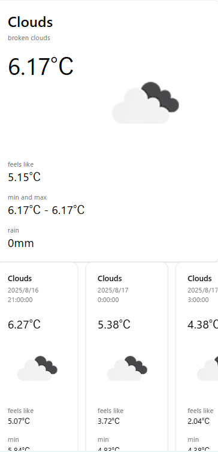

## Weather Checker
This is a Next.js application for checking the weather. It shows the current weather and a 5-day forecast based on your current location.



## Demo
You can try the app here.  
[Weather Checker on AWS Amplify](https://main.d29yly3drdj0zh.amplifyapp.com/)

## Technologies Used
- Next.js (App Router)
- TypeScript
- tailwindcss
- shadcn/ui
- GitHub
- AWS Amplify

## External API
- OpenWeather API

## Getting Started
Follow these steps to get this project up and running locally.

### Prerequisites
- Node.js and npm

### Installation
1. Clone this repository
  ```bash
  git clone https://github.com/dino0320/weather-checker.git
  cd weather-checker
  ```

2. Install dependencies
  ```bash
  npm ci
  ```

3. Start the development server
  ```bash
  npm run dev
  ```

4. Access the app at http://localhost:3000